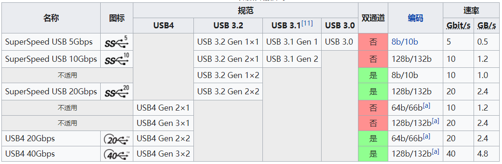

# USB4合集

概念：USB4 是一个 **Tunnel **技术，必须承载其他上层协议如 USB3\.2, PCI Express, DisplayPort，HostInterface。而且为了向下兼容，Alt mode、bypass也是必须支持的（当然PCIE没有直通）。

USB4 V2 推出的 USB3\.2 GenT Tunneling（optional） 可以提高USB单外设性能，不再受到转换限制，这要求USB控制器/USB4控制器本身支持Gen T。

以及 Tunnel 其他协议的 Host to Host。跑满120Gbps单向（非对称\+另一方向40Gbps），160Gbps总。

**这里的Tunnel 技术指的是什么**

把已有协议的数据包再包一层，使得最底层的传输时换个物理层协议（换个PHY）去传输，中间封包解包时再添加Tunnel的协议、调度、配置等功能层次。从而提高一个接口传输不同协议数据的吞吐量。当然USB4还有部分新协议如USB3\.2 GenT引入，这里暂不说明。

而不必要做 alt mode 只能让某些pin选一个功能：比如原来一个接口只能 dp altmode \+ usb3 5gbps 同时使用，现在可以同时 dp \+ usb3 20gbps 同时按需调度传输。

USB4 的**单外设性能**提升主要是在 PCIE、USB3 GenT 上做文章，USB3\.2 仍然最高 20Gbps。由于 GenT 对Host是可选的，通常超快移动硬盘都是用 USB3\.2 Alt 模式\+ USB4 PCIE Tunnelling 模式

USB4 和雷电3的区别主要在必选支持和可选支持的功能列表（如PCIE是可选还是必选）、供电等有微小差异。

# USB4 架构简介

USB4 主要实现了以下协议的隧道：

- PCIE（可选，雷电为必选）

- USB3\.2 Gen X（5G、10G）

- USB3\.2 Gen T \(upto 80Gbps\)

- DP的tunnelling

- Host Interface

- USB2\.0（1\.2M、12M、480M）则是保留并行总线的架构，即DP/DM直通USB2\.0控制器。

# \[New\] USB4 Host\-to\-host 传输技术

USB4 隧道技术会把承载协议进行封包。

现已支持host to host传输技术，可以通过USB4链路的Host Interface Adapter进行其他协议的承载，如IP包。

使用教程：

- Windows下使用教程：[Universal Serial Bus 4 \(USB4™\) interdomain connections](https://learn.microsoft.com/zh-cn/windows-hardware/design/component-guidelines/usb4-interdomain-connections)

- Linux下使用教程：[USB4 and Thunderbolt \| Networking Over Thunderbolt Cable](https://docs.kernel.org/admin-guide/thunderbolt.html#networking-over-thunderbolt-cable)

- macos使用教程：[Use IP over Thunderbolt to connect Mac computers](https://support.apple.com/guide/mac-help/ip-thunderbolt-connect-mac-computers-mchld53dd2f5/mac)

# USB4 速率简介

当主机与设备不支持可选的PCIe隧道传输时，最大非显示带宽被限制为USB 3\.2 20Gbps（Gen 2x2），而仅有**USB 3\.2 10Gbps（Gen 2x1）是强制实现）**

如果USB4 DFP不支持USB3\.2 10Gbps（且是单lane的Gen2x1）、DP 1\.4a，则不能打上USB4的宣传，无法过认证。

USB4 PHY本身只需要支持至少10Gbps（可以宣传为 USB4 Gen2，注意USB4压根没有USB4 Gen1的版本标识，V1 Spec就指定的是Gen2的名字）。

USB4的\>=40G可以认为是：

- USB3\.2（最大总带宽20Gbps）\+DP\+PCIE（optional）同时。

或者：

- USB3 GenT 支持 10Gbps Sym \~ 120Gbps Asym \+ DP\+PCIE（optional）同时。

如果USB4硬盘盒需要超过20Gbps，就不能走USB3\.2模式，要走PCIE模式或者USB3 Gen T模式。然而实际上市面上售卖的雷电3、USB4超过20GGbps的硬盘盒，基本都是PCIE\+USB GenX模式（从而兼容性最佳）。

（realword：mac studio m4，amd395 产品大部分都只支持3\.1Gen2,3\.2Gen2x2 的支持很少，mac不支持）本身Gen2x2 对 USB4 来说也是可选的

并且由于是物理层tunneling，因此所有重新组包不在乎协议的lane数限制并且由于是tunneling，因此所有重新组包不在乎协议的lane数限制。

Q：如果一个 USB4 40Gbps Sym HUB 上面挂了两个 USB3\.2 20Gbps U盘，这两个U盘能同时跑满速吗？

A：USB4 V1 GenX 依赖链路HUB兼容性不支持。

GenT（USB4 V2引入的可选支持） 支持。并且整个设备到链路必须是USB4设备，否则还是走GenX。

这个对链路要求高（XHC、USB4 HUB/USB4 Dock、USB4 Peripheral 都要支持一个USB4V2可选功能），因此厂家还不如用 PCIE，另一个重点就是通常超级高速外设如硬盘、显卡本身做PCIE更加方便，综合成本等考虑，Gen T应该难以推广，还不如直接用PCIE Tunneling。

# USB4 向后兼容性

兼容性是通过额外搞一套实现的。

包括：

- 所有USB4 hub中包含一个USB3\.2 HUB，可以用mux切换lane线路通路是打到usb4 adapter还是直接打到usb3\.2 hub。

- 对power delivery的支持，如不基于usb4 tunnelling的dp over typec。

- usb2本来就是额外一套。

- pcie不支持额外一套，必须经过usb4 pcie adapter的tunnelling。

# USB3 GenX V\.S\. USB3 GenT

GenX 就是之前普通的 USB3，多级 HUB 的时候，走HUB通信。

USB4 V2 为了最大利用带宽，提出了 USB3 GenT,GenT 扩展解决了 3\.2最大20Gbps的限制，GenT 可以 Bypass 中间的 USB3 HUB，完全利用USB4 的下层进行更加高效的传输。

USB3 Gen T支持的速度可配置和USB4 链路速度是一样的 （10Gbps/10Gbps Sym \~ 120Gbps/40Gbps Asym）：

# USB4 Tunnel介绍

**USB相关概念：**

1. **USB3\.0** 

    1. USB3\.0 是 USB2\.0 \+ SuperSpeed Bus 的双总线架构。

    2. 定义了 5Gbps 的 Phy，1 lane 全双工通道。

2. **USB3\.1** 定义了：

    1. USB3\.1 是 USB2\.0 \+ Enhanced SuperSpeed Bus 的双总线架构，其中 Enhanced SuperSpeed Bus兼容SuperSpeed Bus。

    2. 5Gbps 的 Phy ，1 lane 全双工通道。本质上是兼容 USB3\.0 称为 **USB3\.1 Gen1**。

    3. **【NEW】10Gbps **的 Phy，1 lane 全双工通道。称为 **USB3\.1 Gen2**

3. **USB3\.2 **定义了：

    1. USB3\.1 是 USB2\.0 \+ Enhanced SuperSpeed Bus 的双总线架构，其中 Enhanced SuperSpeed Bus上兼容5G、10G，使用Gen划分。

    2. **增加 Dual\-Lane Operation（typec port only）**。这个当然不是一个必须支持的功能，很自觉地可以想到，毕竟3\.2也要兼容3\.1，3\.0。因此在PortMatch过程LBPM握手的时候会交换PHY capability（USB3\.2 Spec 7\.5\.4\.5\.1）。

    3. 5Gbps 的 Phy ，

        1. 1 lane 全双工通道。本质上是兼容 USB3\.0 称为 **USB3\.2 Gen1x1**（=USB3\.1 Gen1=USB3\.0）。

        2. **【NEW】2 lane** 全双工通道。称为** USB3\.2 Gen1x2 **。

    4. 10Gbps 的 Phy，

        1. 1 lane 全双工通道。本质上是兼容 USB3\.1 称为 **USB3\.2 Gen2x1**（=USB3\.1 Gen2）。

        2. **【NEW】2 lane** 全双工通道。称为** USB3\.2 Gen2x2 **

4. **USB4** 主打tunnel，整个都是一层新的东西：

    1. **全新的 PHY**：10Gbps，20Gbps，40bps，**lane 可选1到2**，以及**非对称**（tx、rx 1比3）。可用于 tunneling：DP、USB3\.2、PCIE。

    2. USB3\.2 的全部但是20Gbps为**可选**支持（毕竟要兼容vendor的省钱需求，如果省到只有5Gbps，是不能营销为USB4的，可以叫全功能typec）。

    3. **PCIE**的**可选**支持、**DP1\.4a**（不支持2\.0）的**部分可选部分必选**支持（Host和HUB必须有一个DP，不支持DP Tunnelling的也不能营销为USB4，并且必须兼容typec Alt mode）。

    4. **USB3\.2 GenT**，**（可选）**更换USB3\.2的链路层和物理层为USB4的。使USB的带宽能占满USB4的带宽。

# USB4 物理接口（TypeC）

对应lane分配时，pin脚定义和USB3\.2 Gen2x2 使用的基本一致，即具有最多两 lane 的 Tx Rx 差分全双工。

USB2\.0 DPDM、模拟audio（根据CC的上下拉DPDM alt）等仍然是独立总线，不走tunnel。

USB4 PHY 握手失败后，需要fallback到USB3\.2独立总线（直通控制器，thats why USB4 have a concept of router）。

非对称lane分配时，lane根据协议协商选用，过程过于复杂，这里不再介绍，请参考USB4规范文档。

# 测试项建议

1. USB4多功能设备。

2. USB4 hub拓扑。

3. 普通USB3\.2、DP设备兼容。

4. USB2\.0、Audio Alt mode。

5. USB4 PCIE SSD。

6. USB4 USB3\.2 Gen T SSD。

7. USB4 Host\-to\-host。

8. 雷电互兼容性。

# 附录 \- 软件支持

USB4规范第一版2019发布，V2（80Gbps） 2023发布。操作系统的支持：

- **Linux kernel ****5\.6,** released on 29 March 2020

- macOS Big Sur \(11\.0\), released on 12 November 2020

- **Windows 11**, released with support for USB4 Version 1\.0 on 5 October 2021

    - upgraded to USB4 Version 2\.0 support including 80 Gbit/s around March 2024

Linux对USB4的驱动支持：

- 主流的USB4、雷电控制器都是PC上挂在PCI总线上的（比如Intel的几个Lake系列都是用的雷电4），驱动加载在 drivers/thunderbolt/nhi\.c。

- 注册为一个pci\_driver，PCI为USB4分配的class id=0x0c0340。

- 因此不建议去做non\-PCI的USB4控制器（虽然不知道到底目前有没有存在这种不基于PCI的USB4控制器做法，Apple silicon的未知，目前asahi也没有逆向出支持）

# 附录 \- References

- USB Spec

- [www\.synopsys\.com](https://www.synopsys.com/content/dam/synopsys/china/whitepapers/usb4-wp-sc.pdf)

